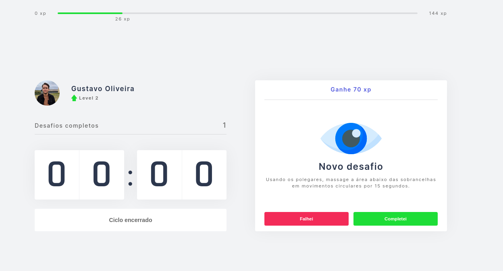

<h1 align="center">
    NLW4 - MOVIT
</h1>

 Aplicação desenvolvida durante a Next Level Week 4! 

  

    

<h2 id="technologies"> 🛠 Tecnologias </h2>

Essas foram as principais tecnologis utilizadas durante o desenvolvimento!

- [Next](https://nextjs.org)
- [SASS](https://sass-lang.com/)
- [TypeScript](https://www.typescriptlang.org/)

